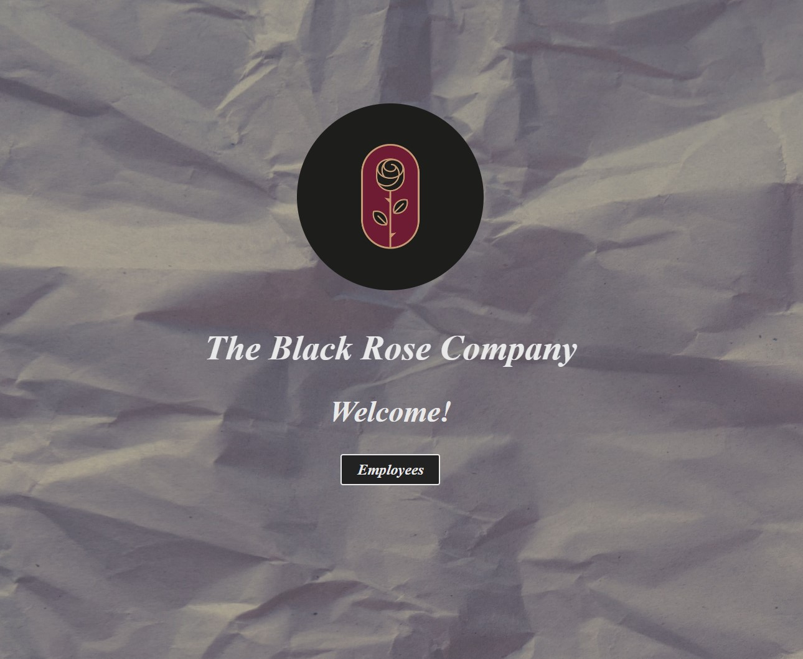
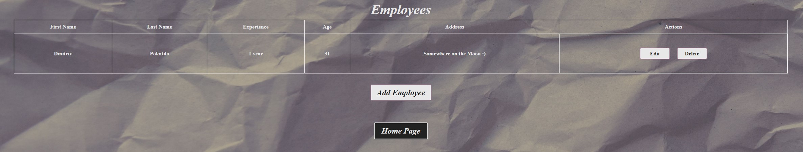

# Employees List

🌹 Link: https://employees-list.netlify.app/
## :pushpin: What is it?
List of employees app.
## :pushpin: What is used?
+ Vue 3 / Nuxt 3
+ SCSS
+ Git / Netlify
## :pushpin: Structure
App consists of five components:
+ **App.vue** 
  Main project component.
+ **HomePage.vue** 
  Title page with navigation.
+ **EmployeeList.vue** 
  A component containing a table of employees, a form for adding and editing employees, various methods for interacting with elements and data.
+ **Modal.vue** 
  A modal window that is called for the form of adding/editing employees.
+ **NavigationButton.vue** 
  Navigation button component.
+ **Main.scss** 
  Common project styles.
+ **Reset.scss** 
  Resetting browser styles.
## :pushpin: Features
+ You can add employees to the list.
+ You can edit the added employee in the list.
+ You can remove the added employee from the list.